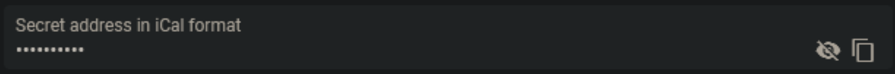

# ETIT-Master-JS

   
  
   
   
See <a href="https://github.com/Chr1s70ph/ETIT-Master-JS/wiki">here</a> how to use and configure the bot

- [ETIT-Master-JS](#etit-master-js)
  - [Install](#install)
  - [Configuration](#configuration)
    - [Prefix](#prefix)
    - [Presence](#presence)
    - [IDs](#ids)
      - [ServerID](#serverid)
      - [ChannelIDs](#channelids)
        - [Subject](#subject)
      - [UserIDs](#userids)
      - [RoleIDs](#roleids)
    - [Calendars](#calendars)
    - [Bot Token](#bot-token)

## Install

Clone the repository, `cd` into it and run `npm install`.

---

## Configuration

Rename `EXAMPLE_config.json` to `config.json`.
Here you can set your prefix, channelIDs, roleIDs, Bot-Token and rich presence of the bot.

### Prefix

Simply set the value of the `prefix` key to whatever prefix you want the bot to use

### Presence

The entries in `#presence` are counting. Increment new entry keys by one.
`activity#name` is the text that is displayed as the bots presence.
For valid `activity#type` values check [here](https://discord.js.org/#/docs/main/stable/typedef/ActivityType).

### IDs

#### ServerID

Here you can set the server-ID of the server you want the bot to operate in.

#### ChannelIDs

    Set bottest to the channel-ID of the channel, you want the bot to send the startup message to.

##### Subject

Here you can set the names of the channels you want the bot to send the notifications to.
> NOTE: The key-values **have** to be included in the event name in your calendar.
> Make sure you have the same key-values as your subject role-IDs

#### UserIDs

    Set the botUserID to your bots user ID

#### RoleIDs

    Set adminRole to your servers Admin-Role-ID and add the Developer-Role-ID
These are used to check if a user has the right to use bot commands.

**Subjects**
Set the subjects to the role-IDs of your event roles. These are the roles that are pinged, when an event is sent.
> NOTE: The key-values have to be included in the event name in your calendar.
> Make sure you have the same key-values as your subject channel-IDs

---

### Calendars

You can add as many calendars as you want.
Check [here](https://support.google.com/calendar/answer/37111?hl=en) on how to get your ical Link.
Simply scroll down to the bottom and copy your `Secret address in iCal format`.

---

### Bot Token

Check [here](https://github.com/reactiflux/discord-irc/wiki/Creating-a-discord-bot-&-getting-a-token) on how to get the bot token of your bot, or create a new bot.

